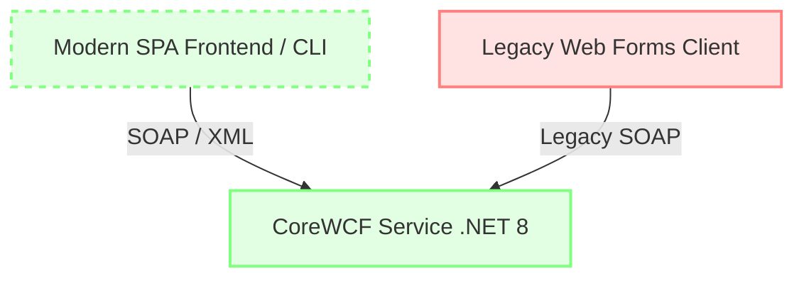

Cloud Migration Prototype & Legacy Modernization
================================================

This repository serves as an active prototype demonstrating a secure, low-risk path to modernize legacy, Windows-dependent enterprise applications. 

## Core Modernization Challenge

Many critical enterprise microservices are tied to legacy technologies such as Windows Server, IIS, and full .NET Framework. Continuing to run these environments introduces severe operational and security risks:
- **High Maintenance Overhead:** Windows Server licensing and manual IIS configuration are expensive and hard to automate.
- **Security & Support Vulnerabilities:** Legacy .NET Framework versions face diminishing support profiles, make patching difficult, and limit modern security controls.
- **Architectural Rigidity:** Impossibility of running on lightweight, cloud-native container runtimes (like Linux-based Kubernetes, ECS, or serverless models).

## Migration Architecture

We employ the **Strangler Fig Pattern** to incrementally replace legacy components with modern alternatives without a synchronous, risky "big bang" rewrite.



### 1. Transitional Modernization via CoreWCF
* **Portability:** Translates aging SOAP service contracts (`TodoWCFService`) from IIS-anchored WCF to **CoreWCF running on .NET 8**.
* **Containerization:** Enables hosting identical SOAP endpoints on ultra-lightweight Linux containers (Docker), achieving modern OS-level orchestration and reducing host OS footprint.
* **Contract Preservation:** Retains existing XML schemas and CRUD API contracts intact. This allows legacy consumers (like the Windows-bound `TodoWeb` app) to continue working unchanged during transition phases.

### 2. Risk Mitigation through Integration & Schema Validation
The modernization focuses on validating the **SOAP service boundary**:
* **Integration Sufficiency:** Rather than relying on a heavy React interface to prove backend viability, we utilize a lightweight, Node.js-based SOAP client harness (`todo-spa/src/client`).
* **Contract Validation:** The CLI harness performs rigorous API contract verification and data schema validation against the runtime WCF service.
* **Parallel Migration Paths:** By validating the modernized CoreWCF backend in isolation, the business can establish a parallel greenfield operations path (such as deploying to a modern cloud cluster) whilst keeping historical operations running concurrently to prevent service disruptions.

---

## TodoWCFService
Hostable SOAP service migrated to CoreWCF on cross-platform .NET 8.

The service, matching original WCF behaviors on `/TodoService.svc`, exposes:
- `GetTodoItems` - list active items (UUID, Name, Notes, Done)
- `CreateTodoItem` - persist new entries (requires both Title and Notes)
- `EditTodoItem` - update existing entries
- `DeleteTodoItem` - delete a record

To spin up the service for integration validation and testing:
```bash
cd TodoWCFService
dotnet run
```

---

## TodoCliClient
A super-lightweight .NET 8 console test harness for validating the legacy `TodoService` endpoints. 

- **Proxy Generation:** Uses the modern `dotnet-svcutil` CLI tool to parse service WSDL files and automatically generate type-safe proxy clients ([TodoCliClient/Reference.cs](TodoCliClient/Reference.cs)). This streamlines setup, updates, and service-boundary client integrations.
- **Service Verification:** Allows rapid sanity checking of connection rules and CRUD transactions directly from a lightweight shell without needing browser dependency setups.

To run the .NET CLI Client:
```bash
cd TodoCliClient
dotnet run
```

---

## Getting Started with the SPA & Client CLI
A modern frontend scaffold and diagnostic client harness is located at `todo-spa`.

### Prerequisites
1. Ensure Node 20.19+ or 22.12+ is installed.
2. Bootstrap `pnpm` (preferred package manager):
   - `corepack enable`
   - `corepack prepare pnpm@latest --activate`

### Setting up the Directory
```bash
cd todo-spa
pnpm install
```

### Running the SOAP CLI Client Harness
The CLI client acts as the integration testing validation suite for the CoreWCF backend:
```bash
# Start interactive menu
pnpm run client

# Run command-line validations
pnpm run client -- --list
pnpm run client -- --create "Buy milk" "organic whole milk"
pnpm run client -- --edit   <id> "Updated title"
pnpm run client -- --delete <id>
pnpm run client -- --wsdl         # Dump discovered service WSDL and methods
```

### Running the SPA web UI
```bash
pnpm run dev
```

### Auxiliary commands
- `pnpm run build`
- `pnpm run lint`
- `pnpm run test`
